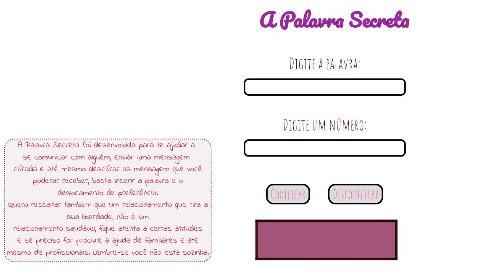
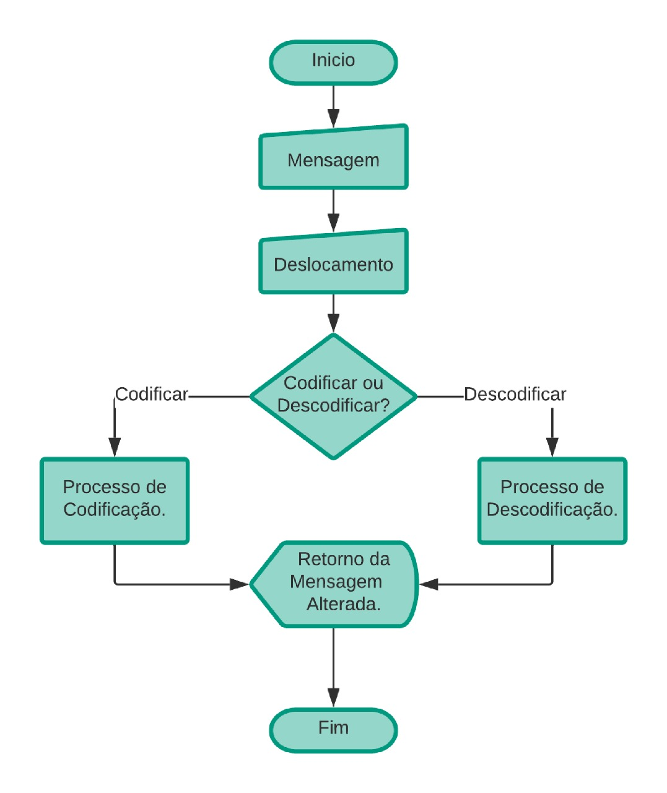

# Cifra de César
## 1. O que é a cifra de Cesar?

Cifrar significa codificar. A [cifra de
César](https://pt.wikipedia.org/wiki/Cifra_de_C%C3%A9sar) é um dos primeiros
tipos de criptografias conhecidas na história. O imperador romano Júlio César
utilizava essa cifra para enviar ordens secretas aos seus generais no campo de
batalha.

A cifra de César é uma das técnicas mais simples de cifrar uma mensagem. É um
tipo de cifra por substituição, em que cada letra do texto original é
substituida por outra que se encontra há um número fixo de posições
(deslocamento) mais a frente do mesmo alfabeto.

Por exemplo se usarmos o deslocamento (_offset_) de 3 posições:

* Alfabeto sem cifrar: A B C D E F G H I J K L M N O P Q R S T U V W X Y Z
* Alfabeto com cifra:  D E F G H I J K L M N O P Q R S T U V W X Y Z A B C
* A letra A será D
* A palavra CASA será FDVD

Atualmente todas as cifras de substituição alfabética simples, são decifradas
com facilidade e não oferecem muita segurança na comunição, mas a cifra de César
muitas vezes pode fazer parte de um sistema mais complexo de criptografia, como
a cifra de Vigenère, e tem aplicação no sistema ROT13.

## 2. Tema do produto
O tema escolhido para o produto é totalmente voltado ao publico feminino, infelizmente vivemos em um País aonde muitas mulheres não podem "ter voz", estão presas a relacionamentos que lhes dão uma vida totalmente limitada e isolada, por ser um assunto muito pouco discutido, para muitas das vitimas só é considerado agressão quando for fisica, deixando de lado a agressão moral e psicologica. O relacionamento abusivo tem ficado cada vez mais comum, pois muitos dos casos a propria vitima não percebe que esta vivendo tal situação, que futuramente pode gerar agressões ainda piores, resultando ate mesmo em morte. 
Pensando em mulheres que sofrem com relacionamento abusivo, que muita das vezes são impedidas de contar e se abrir sobre a questão com algum familiar ou alguma pessoa de confiança, pois o seu parceiro obtem acesso total as suas redes sociais e mensagems. Desenvolvi "A palavra secreta", aonde mulheres poderão criar mensagens cifradas utilizando o deslocamento, e tambem poderão descifrar mensagens cifradas que elas receberem, tornando assim a comunicação mais segura. 

## 3. Criando a aplicação
  Antes de por a "mão na massa", primeiramente deveria ser entendido o que a aplicação iria fazer, ela precisaria ter uma interação com o usuario, aonde o mesmo deveria informar a mensagem logo apos o deslocamento (offset) e por ultimo o usuario iria escolher a opção de codificar ou descodificar, com esses dados informados pelo usuario o sistema iria fazer um processamento de dados (calculos necessarios) e retornar na tela a mensagem criptografada.
       
      
* HTML: No Html foi criado o esqueleto da pagina, aonde foram inseridos quatro inputs, sendo dois do tipo submit, um do tipo text para o usuario inserir a palavra e um do tipo number para inserir o numero de deslocamento. Tambem foi feito um paragrafo dentro de um span, para ter o retorno da palavra criptografada, e o mesmo teria um ligamento com o JavaScript. 
* CSS: O CSS ficou com o estilo da pagina, la foram feitas alterações muito importantes no layout da pagina, como os posicionamentos dos inputs, a imagem , o titulo e as palavras de descrições. Alterações com o texto, fonte, tamanho e cor da letra. Ele tambem ficou responsavel por criar a "caixinha" que iria retornar o resultado ao usuario. 
* JavaScript: Temos dois documentos com a extensão .js, no index é aonde chamamos as funções responsáveis pela a cifragem e a descifragem das mensagens, tambem temos o evento click, que irá ser acionado pelo clique dos botões, chamando então as funções que irá "puxar" pelo id's os dados que o usuario digitou nos imputs, amarzendando-os em variaveis e logo após atribuindo aos parametros das funções do cipher.js. O documento cipher.js, é o mais complexo, pois nele foi feito todo processo de descifrar e cifrar, foram criadas duas funções, uma para encode e outra decode, em cada uma foi criado uma variavel vazia do tipo string que logo apos seria armazenado as letras alteradas e elas seriam chamadas nos retornos das funções, dentro das funções tambem teve o uso de laços de repetições, condições e tambem teve o calculo do deslocamento. 

## 4. Considerações gerais

* Este projeto foi desenvolvido por: Aline de Lima Chaves
* Acredito que cumpri aquilo que foi proposto, como descodificação e codificação de letras maiusculas e minusculas, e tambem a aplicação possibilitou ao usuario de escolher além do deslocamentos positivos, tambem os deslocamentos negativos.
* Tempo para completar: tempo referência 2 semanas.
